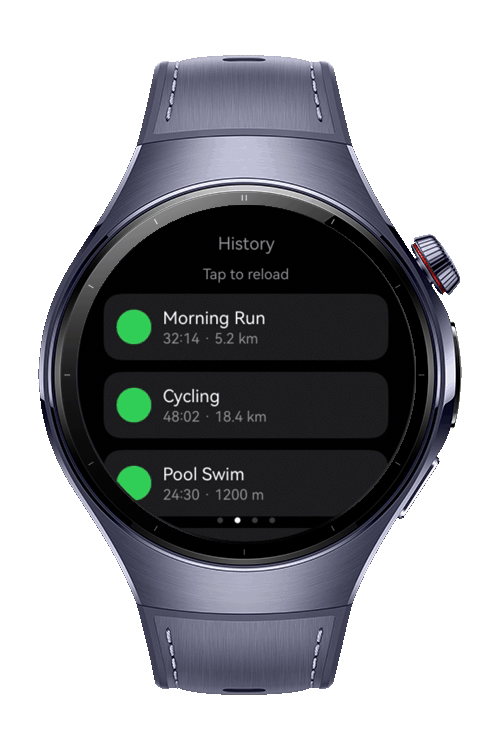
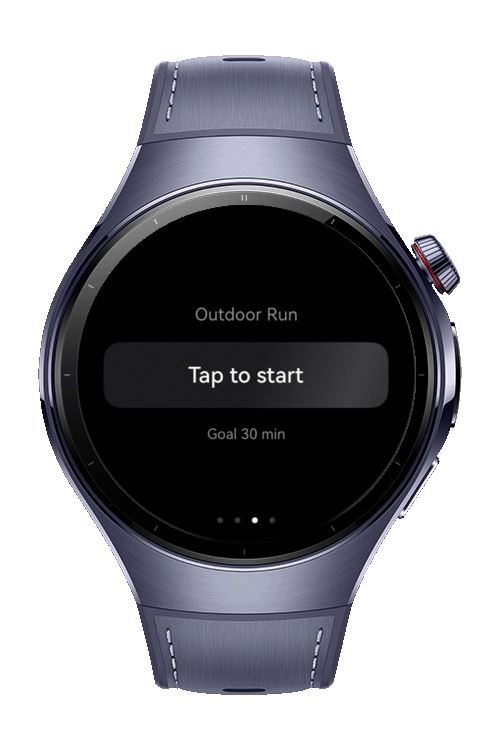
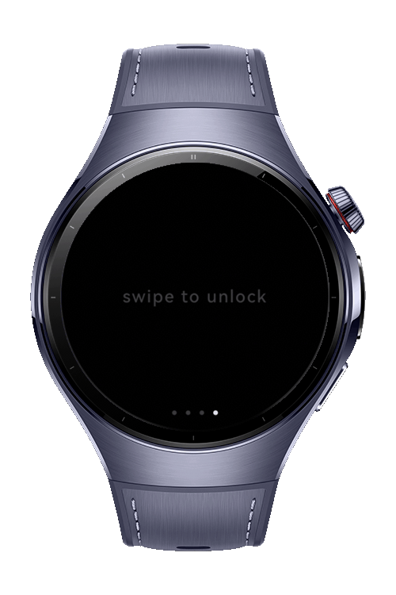

> **Note:** To access all shared projects, get information about environment setup, and view other guides, please visit [Explore-In-HMOS-Wearable Index](https://github.com/Explore-In-HMOS-Wearable/hmos-index).

# Shimmer

A shimmer animation package for HarmonyOS wearables, written in ArkTS. Wraps any content and sweeps a white highlight
across it, so a screen waiting on an API call shows a moving skeleton instead of a blank box.

# Preview

<div align="center">
  
  
  
  
</div>

## How to Install

```bash
ohpm install @explore-in-hmos/shimmer
```

For details about the OpenHarmony ohpm environment configuration, see [OpenHarmony HAR](https://gitcode.com/openharmony-tpc/docs/blob/master/OpenHarmony_har_usage.en.md).

# Usage

Wrap the content that is waiting for data:

```ets
import { Shimmer, ShimmerBox, ShimmerCircle } from 'shimmer';

@ComponentV2
export struct ContactRow {
  build() {
    Shimmer() {
      Row({ space: 8 }) {
        ShimmerCircle({ diameter: 28 })
        Column({ space: 5 }) {
          ShimmerBox({ boxWidth: '76%', boxHeight: 11 })
          ShimmerBox({ boxWidth: '52%', boxHeight: 9 })
        }
        .alignItems(HorizontalAlign.Start)
        .layoutWeight(1)
      }
      .width('100%')
    }
  }
}
```

One wrapper per group of shapes. The band is sized from the wrapper, so shapes under the same wrapper are crossed at the
same speed and in the same phase.

The highlight is clipped to the shape of the content, so text glyphs and icons light up while the space around them
stays dark:

```ets
Shimmer() {
  Text('swipe to unlock').fontSize(15).fontColor($r('app.color.on_surface'))
}
```

Keep a settings object at module level rather than building one inside `build()`, so the reference does not change on
every rebuild:

```typescript
const HINT_SHIMMER: ShimmerOptions = { duration: 2600, widthRatio: 0.35, tilt: 0 };
```

# API

## Components

| Component          | Purpose                                            |
|--------------------|----------------------------------------------------|
| `Shimmer`          | Wraps content and paints the moving highlight      |
| `ShimmerBox`       | Rectangular placeholder; defaults to one text line |
| `ShimmerCircle`    | Round placeholder for avatars and icon slots       |
| `ShimmerParagraph` | Stack of lines, the last one shortened             |

## ShimmerOptions

| Field               | Default       | Purpose                                               |
|---------------------|---------------|-------------------------------------------------------|
| `isEnabled`         | `true`        | When false the content renders without a band         |
| `maskToContent`     | `true`        | Clips the highlight to the shape of the content       |
| `duration`          | `1400`        | One sweep, in milliseconds                            |
| `direction`         | `LeftToRight` | Travel axis, before tilt                              |
| `tilt`              | `20`          | Lean of the band away from the sweep axis, in degrees |
| `curve`             | `EaseInOut`   | Easing across one sweep                               |
| `highlightOpacity`  | `0.35`        | Alpha at the centre of the white band                 |
| `widthRatio`        | `0.65`        | Band length as a fraction of the content span         |
| `borderRadius`      | `0`           | Read when `maskToContent` is off                      |
| `accessibilityText` | `''`          | Read by screen readers instead of the skeleton        |

# Technology

## Stack

- ArkTS with ArkUI state management V2
- DevEco Studio

## Required Permissions

None.

# Directory Structure

```
Index.ets                         public API
src/main/ets/
  animations/ShimmerClock.ets     normalised 0 to 1 sweep driver
  components/Shimmer.ets          the wrapper component
  components/ShimmerSkeleton.ets  placeholder shapes
  geometry/ShimmerGeometry.ets    size and direction to band geometry
  models/ShimmerBand.ets          band geometry
  models/ShimmerOptions.ets       settings and their resolved form
  services/ShimmerDefaults.ets    default values
  styles/ShimmerPalette.ets       gradient stops
  tokens/ShimmerTokens.ets        enums and constants
src/test/LocalUnit.test.ets       geometry and palette tests
```

# Constraints and Restrictions

- The highlight is white at a configurable opacity, so it reads on dark surfaces. Light surfaces need a darker skeleton
  fill underneath.
- Skeleton fills are opaque on purpose. The highlight is clipped to the shape of the content, so a translucent fill
  leaves almost no glow.
- Universal attributes cannot be chained onto the wrapper, so content that should fill the line declares its own width.
- With `maskToContent` on, the content is drawn twice. Prefer one wrapper around a group of shapes over one wrapper per
  shape.

## Supported Devices

- Huawei Watch 5
- DevEco Studio Simulator

# License

Shimmer is distributed under the terms of the MIT License. See the LICENSE for more information.